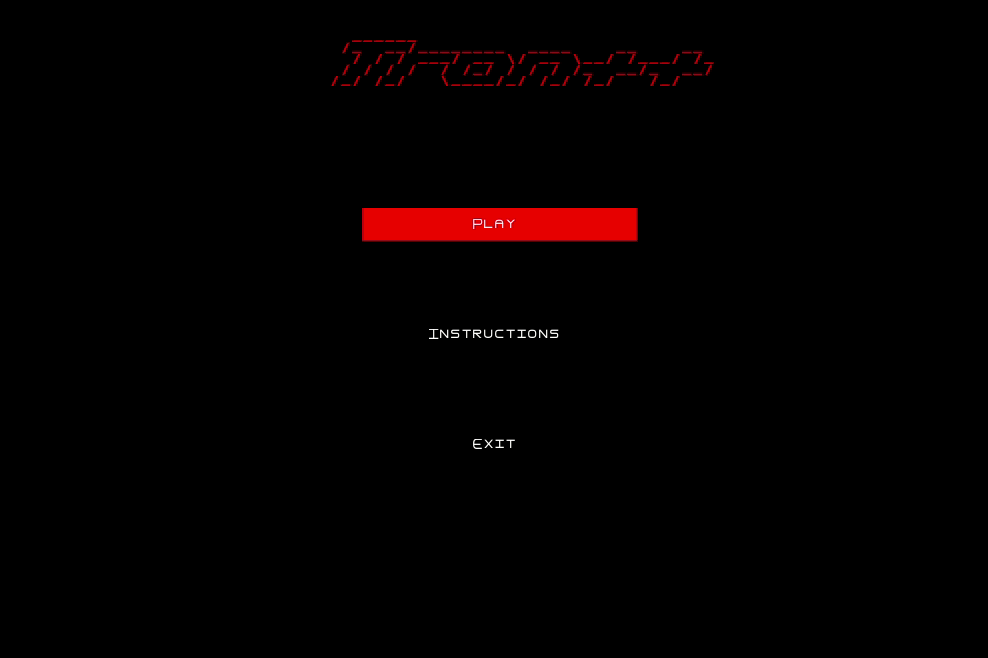
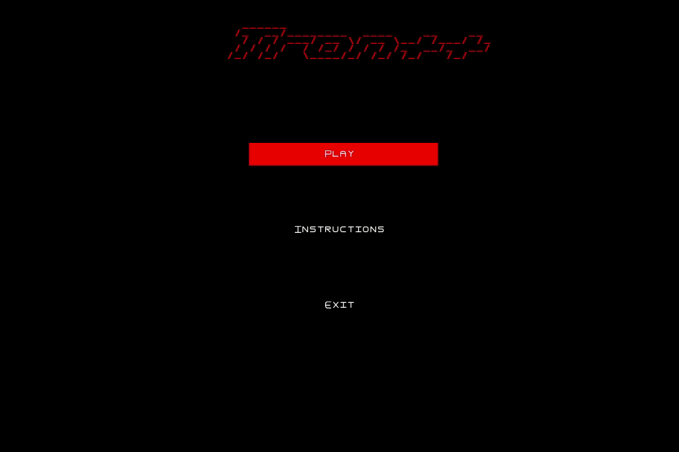
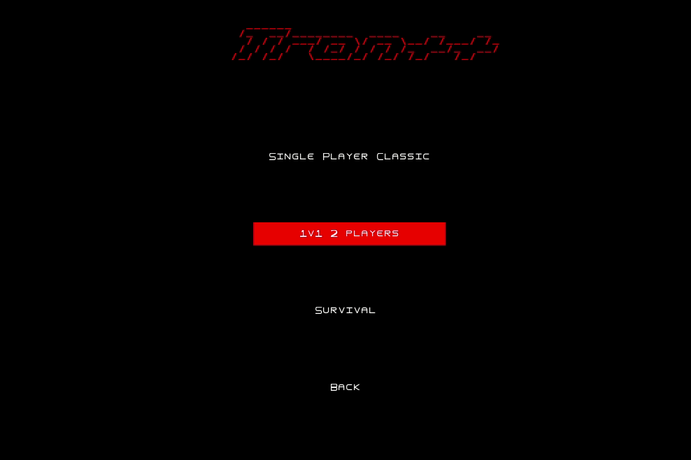
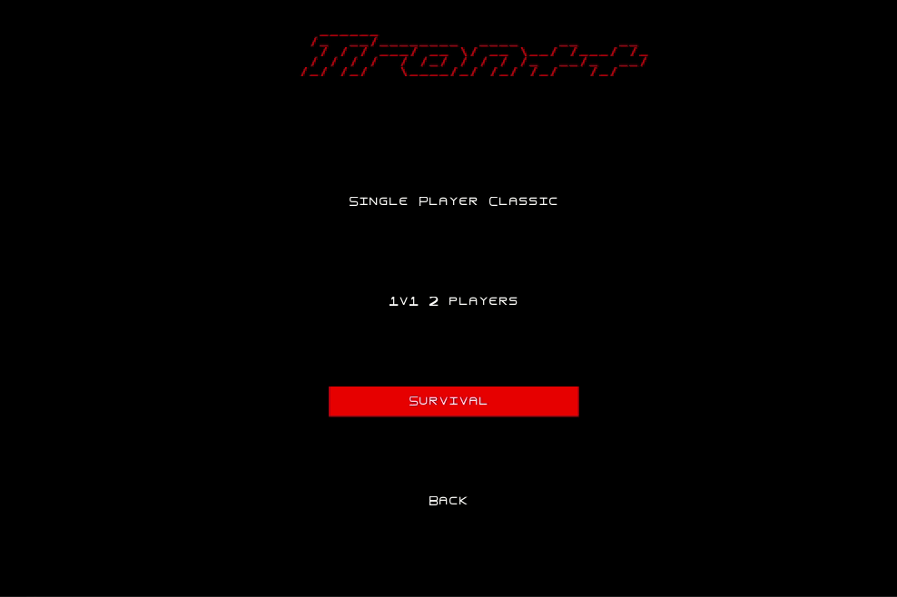

# LDTS Project 1 

## Theme: Tron++ - 2D Snake game based 

### Game description

Tron++, as the name says, it's an arcade-like game based on the popular [Tron game](https://en.wikipedia.org/wiki/Tron_(video_game)).\
The objective is to make your opponent crash against the walls or your/his trails. You can use the boost to move faster.\
Our version of the game has portals as well.

### Screenshots

Here's some insights of our game.

#### Menus

  

  <b><i>Gif 1. Game menus</i></b>

 
 

#### Single player

  

  <b><i>Gif 2. Single player game mode</i></b>

 
 

#### 2 players

  

  <b><i>Gif 3. 1v1 2 players game mode</i></b>

 
 

#### Survival

  

  <b><i>Gif 4. Survival game mode</i></b>

 
 
