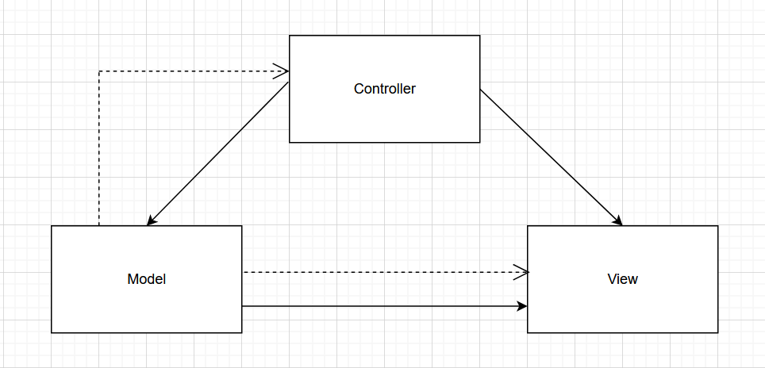
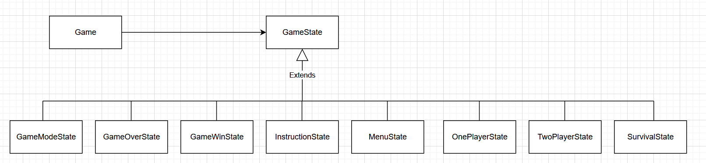
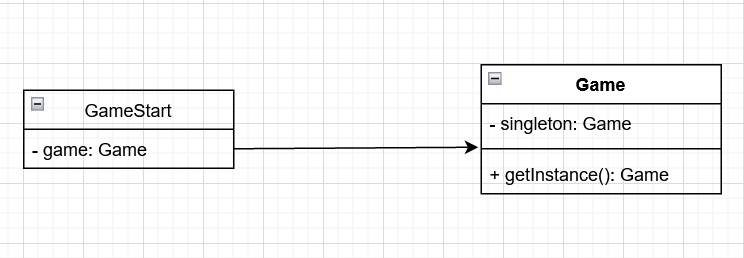
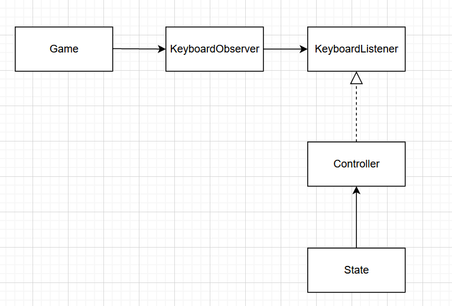
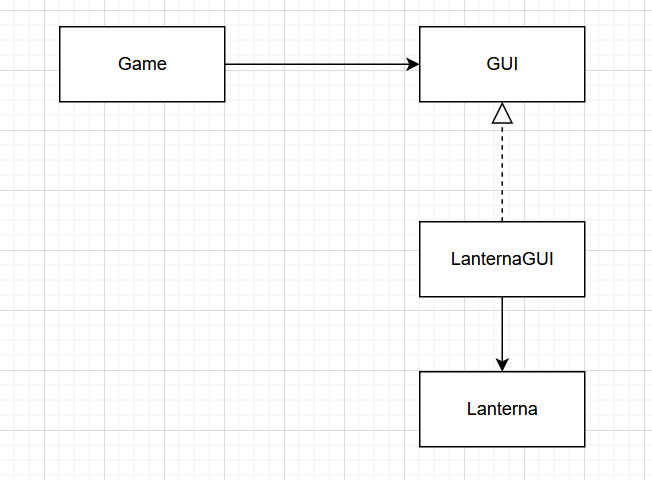
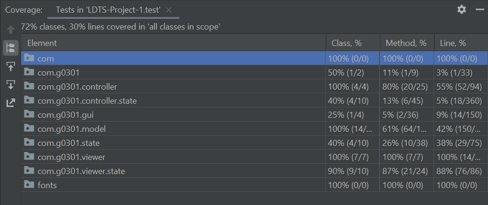

## LDTS_T03G01 - TRON++

In this arcade game, you have to make your opponent crash his car and try to avoid crashing yours.

This project was developed by **Ana Sofia** (up202004606), **Fábio Morais** (up202008052) and **Jorge Sousa** (up202006140).

### Implemented features

- **Different game modes** - There are 3 game modes available: 
  - Classic: Play against a bot
  - 2 players 1v1: Play against another person
  - Survival: Try to stay alive the maximum time possible
- **Menu and Buttons** - The user is provided with an intuitive and easy to use menu with interactive buttons.
- **Keyboard input** - The keyboard input is handled by a listener. It is processed according to the current state of the game.
- **Player movement** - The game can be played by 2 players simultaneously. The players can move their cars using the keyboard.
- **Boost** - The players can use the boost, that is limited but rechargeable, to make their cars move faster.
- **Collisions** - Collisions between 2 players, a player and its own trail and a player and the arena walls.
- **Portals** - There are portals scattered across the map that can only be used once. The players that enter a portal will be transported to its exit. The portal's entries/exits are matched by the same color.

### Planned features

There are some features we planned to implement, but didn't manage to:
- Experience system
- Powerups
- Different cars and cenarios
- The trail being destroyed by bullets fired by the cars

### Design

### Project Structure

**Problem in context**

The first problem was how we should structure the project.

**The pattern**

The pattern that we chose to use was the ***MVC (Mode-View-Controller)***, that is an architectural pattern. We think the use of this pattern was a good choice, given the project's theme and the fact that we are working with a GUI.

**The implementation**

The classes responsible for handling the user input are the **Controllers**, the ones responsible for the game's logic are the **Models** and the responsibles for displaying the game's information are the **Viewers**.
Given a user input, the controller processes it and tells the model what to do, depending on the input.
In order to display the action triggered by the input, the controller calls the viewer.

  

  <b><i>Fig 1. Model, Controller and Viewer pattern</i></b>

**Consequences**
- Faster development
- Easy to add new features

### Differente game states

**Problem in context**

The game has a variety of states during its execution. For example, the main menu, the instructions menu, each game mode represent different states of the game.

**The pattern**

The solution we found to solve this problem was to use the ***State pattern***, which allows an object to change its behaviour when the internal state changes.

**The implementation**

We created classes for each state. These classes define how the game should behave when in the state they represent.

  

  <b><i>Fig 2. State pattern</i></b>

These classes can be found in the following files:\
[Game](https://github.com/FEUP-LDTS-2021/ldts-project-assignment-g0301/blob/main/src/main/java/com/g0301/Game.java)\
[GameState](https://github.com/FEUP-LDTS-2021/ldts-project-assignment-g0301/blob/main/src/main/java/com/g0301/state/GameState.java)\
[GameModeState](https://github.com/FEUP-LDTS-2021/ldts-project-assignment-g0301/blob/main/src/main/java/com/g0301/state/GameModeState.java)\
[GameOverState](https://github.com/FEUP-LDTS-2021/ldts-project-assignment-g0301/blob/main/src/main/java/com/g0301/state/GameOverState.java)\
[GameWinState](https://github.com/FEUP-LDTS-2021/ldts-project-assignment-g0301/blob/main/src/main/java/com/g0301/state/GameWinState.java)\
[InstructionState](https://github.com/FEUP-LDTS-2021/ldts-project-assignment-g0301/blob/main/src/main/java/com/g0301/state/InstructionState.java)\
[MenuState](https://github.com/FEUP-LDTS-2021/ldts-project-assignment-g0301/blob/main/src/main/java/com/g0301/state/MenuState.java)\
[OnePlayerState](https://github.com/FEUP-LDTS-2021/ldts-project-assignment-g0301/blob/main/src/main/java/com/g0301/state/OnePlayerState.java)\
[TwoPlayerState](https://github.com/FEUP-LDTS-2021/ldts-project-assignment-g0301/blob/main/src/main/java/com/g0301/state/TwoPlayerState.java)\
[SurvivalState](https://github.com/FEUP-LDTS-2021/ldts-project-assignment-g0301/blob/main/src/main/java/com/g0301/state/SurvivalState.java)

**Consequences**
- Partitions behaviour for different states
- Makes state transitions explicit
- More classes to manage

### Only one game

**Problem in context**

Only one instance of the game is created each time we run the program.

**The pattern**

We used this property of the Game class to implement the ***Singleton pattern***, sometimes considered an anti-pattern, but we found it a good choice given the nature of the project.

**The implementation**

A static variable of type game was created. This variable represents the single instance of the Game class. 
To make use of this variable, a new static method was created and its function is to initialize the variable if its value is null, otherwise it just returns it.

  

  <b><i>Fig 3. Singleton pattern</i></b>

These classes can be found in the following files:\
[Game](https://github.com/FEUP-LDTS-2021/ldts-project-assignment-g0301/blob/main/src/main/java/com/g0301/Game.java)\
[GameStart](https://github.com/FEUP-LDTS-2021/ldts-project-assignment-g0301/blob/main/src/main/java/com/g0301/GameStart.java)

**Consequences**
- Harder to test code

### Observer and listener

**Problem in context**

There are several ways to handle user input. We decided to use a KeyListener and a KeyObserver.

**The pattern**

For this purpose, we applied the ***Observer Pattern***, which is considered a behavioural pattern.

**The implementation**

We created a KeyboardObserver instance in the Game class. The listener is changed when the game state changes, so that the user input is processed accordingly.

  

  <b><i>Fig 4. Observer pattern</i></b>

These classes can be found in the following files:\
[Game](https://github.com/FEUP-LDTS-2021/ldts-project-assignment-g0301/blob/main/src/main/java/com/g0301/Game.java)\
[KeyboardObserver](https://github.com/FEUP-LDTS-2021/ldts-project-assignment-g0301/blob/main/src/main/java/com/g0301/gui/KeyboardObserver.java)\
[KeyboardListener](https://github.com/FEUP-LDTS-2021/ldts-project-assignment-g0301/blob/main/src/main/java/com/g0301/state/KeyboardListener.java)\
[Controllers](https://github.com/FEUP-LDTS-2021/ldts-project-assignment-g0301/tree/main/src/main/java/com/g0301/controller/state)\
[States](https://github.com/FEUP-LDTS-2021/ldts-project-assignment-g0301/tree/main/src/main/java/com/g0301/state)

**Consequences**
- Game class only knows that the KeyboardObserver implements the KeyboardListener interface
- No need to change the Game class in order to add more observers

### GUI

**Problem in context**

We wanted a more structured way to deal with the Lanterna library. We wanted to use the Lanterna methods, but more directed to our case.

**The pattern**

We chose the ***Facade pattern***, a structural pattern, because it hides the complexity of a system and presents the user a simple interface.

  

  <b><i>Fig 5. Facade pattern</i></b>

These classes can be found in the following files:\
[Game](https://github.com/FEUP-LDTS-2021/ldts-project-assignment-g0301/blob/main/src/main/java/com/g0301/Game.java)\
[GUI](https://github.com/FEUP-LDTS-2021/ldts-project-assignment-g0301/blob/main/src/main/java/com/g0301/gui/Gui.java)\
[LanternaGUI](https://github.com/FEUP-LDTS-2021/ldts-project-assignment-g0301/blob/main/src/main/java/com/g0301/gui/LanternaGUI.java)

**Consequences**
- Shields the users from the system components
- Allows easier modifications

### Known code smells and refactoring suggestions

#### Large Class

The [LanternaGUI](https://github.com/FEUP-LDTS-2021/ldts-project-assignment-g0301/blob/main/src/main/java/com/g0301/gui/LanternaGUI.java) class has many methods, but we find it justifiable, because the interface requires a large amount of methods and it wouldn't make sense to separate them.\
The [OnePlayerArena](https://github.com/FEUP-LDTS-2021/ldts-project-assignment-g0301/blob/main/src/main/java/com/g0301/model/OnePlayerArena.java) and [SurvivalArena](https://github.com/FEUP-LDTS-2021/ldts-project-assignment-g0301/blob/main/src/main/java/com/g0301/model/SurvivalArena.java) classes have many methods due to some of them being responsible for the movement of the bot. We could improve the code by moving these methods to the Bot class.

#### Large Method

Some of our methods are too long. Some examples are:
- The [keyPressed](https://github.com/FEUP-LDTS-2021/ldts-project-assignment-g0301/blob/main/src/main/java/com/g0301/controller/state/TwoPlayerController.java) method in TwoPlayerController class
- The [action](https://github.com/FEUP-LDTS-2021/ldts-project-assignment-g0301/blob/main/src/main/java/com/g0301/controller/state/OnePlayerController.java) method in OnePlayerController class

To solve this problem, we could separate the if statements into methods.

#### Duplicate code

Since some of our features have common properties, duplicate code started to appear and can be found in the next methods:
- upClearPosition, downClearPosition, leftClearPosition, rightClearPosition and wallCollision methods are the same in the OnePlayerArena and SurvivalArena classes.

[OnePlayerArena](https://github.com/FEUP-LDTS-2021/ldts-project-assignment-g0301/blob/main/src/main/java/com/g0301/model/OnePlayerArena.java)\
[SurvivalArena](https://github.com/FEUP-LDTS-2021/ldts-project-assignment-g0301/blob/main/src/main/java/com/g0301/model/SurvivalArena.java)

To solve this problem, we could move these methods to the Arena superclass (Extract method).

#### Refused Bequest

While trying to generalize our code by creating abstract classes and interfaces, this code smell surged and can be found in:
- [OnePlayerArena](https://github.com/FEUP-LDTS-2021/ldts-project-assignment-g0301/blob/main/src/main/java/com/g0301/model/OnePlayerArena.java) class
- [TwoPlayerArena](https://github.com/FEUP-LDTS-2021/ldts-project-assignment-g0301/blob/main/src/main/java/com/g0301/model/TwoPlayerArena.java) class
- [Player](https://github.com/FEUP-LDTS-2021/ldts-project-assignment-g0301/blob/main/src/main/java/com/g0301/model/Player.java) class
- [Bot](https://github.com/FEUP-LDTS-2021/ldts-project-assignment-g0301/blob/main/src/main/java/com/g0301/model/Bot.java) class

#### Feature Envy

Due to the nature of the MVC pattern, the controllers call the models' methods, so this code smell is justified.

### Testing

#### Test Coverage

  

  <b><i>Fig 6. Test coverage</i></b>

#### Mutation testing

[Link to mutation testing](../build/reports/pitest/202201292356/index.html)

### Self-evaluation

- Ana Sofia - 28%
- Fábio Morais - 32%
- Jorge Sousa - 40%
